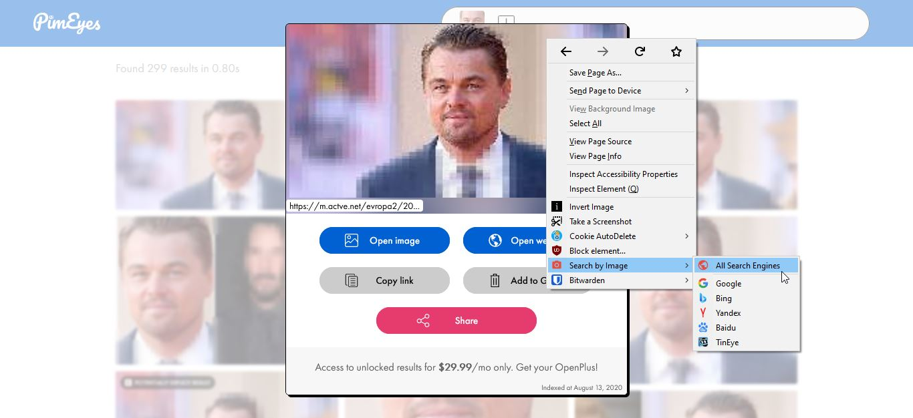

# PimEyes-Crack/UserStyle                          

**-> THIS CRACK NO LONGER WORKS, and will be replaced with a webextension (browser add-on) on january/february 2022. <-**

This "Crack" is simply a couple of css styles that improve your experience while using the face-recognition service [pimeyes.com](https://pimeyes.com)

This css style un-blurs and un-fades the URLs, removes the "UNLOCK" button and removes the on-click event from URLs, so you can select them easier. This crack also removes the "buy premium" overlay from the images, so you can download them or reverse-image-search them with an [addon like search-by-image](https://github.com/dessant/search-by-image) ([Chrome Version here](https://chrome.google.com/webstore/detail/search-by-image/cnojnbdhbhnkbcieeekonklommdnndci)).

## Installation

Go to [this proyect's GreasyFork Page](https://greasyfork.org/en/scripts/406062-pimeyes-crack) and click the "Install as User Style" *button* (not the question mark besides it, the button). 
NOTE: You must have the [Stylus Add-on](https://addons.mozilla.org/en-US/firefox/addon/styl-us/) ([Chrome Version here](https://chrome.google.com/webstore/detail/stylus/clngdbkpkpeebahjckkjfobafhncgmne)) installed

### OR

- Install the [Stylus Add-on](https://addons.mozilla.org/en-US/firefox/addon/styl-us/) ([Chrome Version here](https://chrome.google.com/webstore/detail/stylus/clngdbkpkpeebahjckkjfobafhncgmne))
- Download this repo
- Stylus -> "Manage" -> (on the left side) "Write New Style"
- Delete all the text, and copy-Paste the contents of `styles.css`
- "Save"
- Enjoy :)

### OR

- Install the the [Stylus Add-on](https://addons.mozilla.org/en-US/firefox/addon/styl-us/) ([Chrome Version here](https://chrome.google.com/webstore/detail/stylus/clngdbkpkpeebahjckkjfobafhncgmne))
- Download this repo
- Stylus -> "Manage" -> (on the left down corner) "Import"
- Select the `userstyle-import.json` file you downloaded.
- Enjoy :)

## Limitations

This crack won't bypass the search-limit; You'll have to use a VPN/Proxy. Just make sure to clean all storage for that domain before doing that (Cookies, Site Preferences, Cache, Indexed DB, Local Storage, Service Workers, and Plugin Data); To facilitate this, I recommend the [Cookie AutoDelete Add-on](https://addons.mozilla.org/en-US/firefox/addon/cookie-autodelete/) ([Chrome Version here](https://chrome.google.com/webstore/detail/cookie-autodelete/fhcgjolkccmbidfldomjliifgaodjagh/)).

In recent updates, they made it so everything but the face is blurred. *You'll have to crop the face, and reverse image search _that_* and hope to get the original picture. This crack will still help you download that blurred image though.

The result URLs are obfuscated and cropped to **11** characters. Although this crack will un-blur, un-hide, and make these URLs selectable, we can't recover the original content of these URLs. It's up to you if you'll be able to get back the original URL by recognizing the domain/cdn format.

## Feedback

If you have an issue/request/question/etc feel free to open an issue.

## Screenshots

